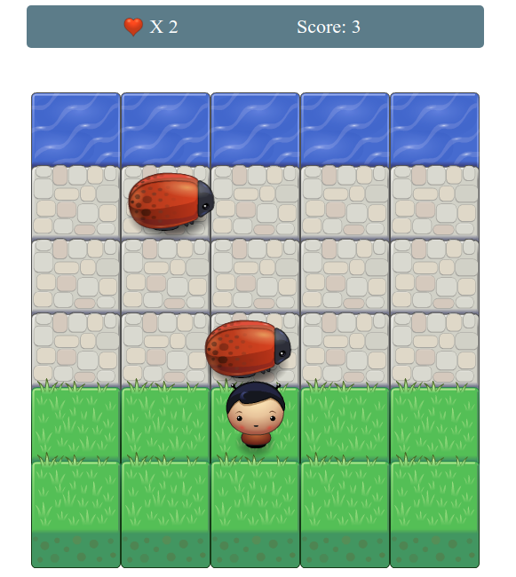
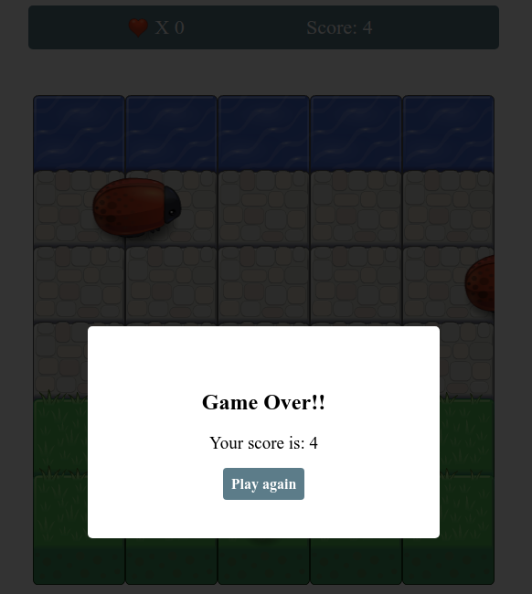

# Classic Arcade Game Clone

A Classic Arcade Game Clone.

LIVE PREVIEW => **[https://ahmedelaguab.github.io/arcade-game/](https://ahmedelaguab.github.io/arcade-game/).**


## Getting Started

* To start playing this game, you have first to either download or clone it to your machine.

```
git clone http://www.github.com/AhmedELaguab/arcade-game
```

* Then simply open `index.html` file and start playing the game.


## How the Game Works

In this game you have a Player and Enemies (bugs). The goal of the player is to reach the water, without colliding into any one of the enemies.


## How to play

* The player can move left, right, up and down.
* The enemies move at varying speeds on the paved block portion of the game board.
* Once a the player collides with an enemy, the game is reset and the player moves back to the starting square.
* When the player collides with enemies three times, the game is Over.
* Once the player reaches the water (i.e., the top of the game board), the game is won & the score increase.


## Screenshots





## Built With

* HTML/HTML5
* CSS/CSS3
* Object Oriented JavaScript (ES6)


## Contributing

This repository is my code to pass the third Project of Udacity Front-End Developer Nanodegree Program. Therefore, I most likely will not accept pull requests.

For details, check out [CONTRIBUTING.md](CONTRIBUTING.md).


## Authors

* **[AhmedElaguab](https://github.com/AhmedElaguab)** - development
* **[Udacity](https://github.com/udacity)** - development
